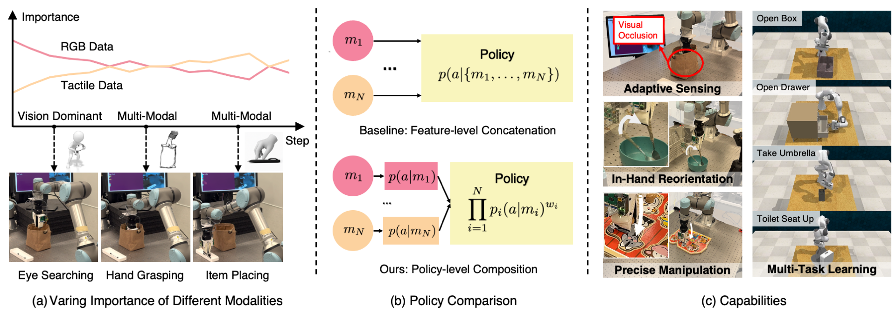

# Multi-Modal Policy Consensus

Multi-Modal Manipulation via Multi-Modal Policy Consensus

📄 [Paper](https://arxiv.org/abs/2509.23468) | 🌐 [Project Page](https://policyconsensus.github.io) | 📝 [Blog](https://www.notion.so/Multi-Modal-Manipulation-via-Policy-Consensus-28645464339980d6a8a4ca588dec3905) | 📝 [Deepwiki]((https://www.notion.so/Multi-Modal-Manipulation-via-Policy-Consensus-28645464339980d6a8a4ca588dec3905)

<a href="https://haonan16.github.io/">Haonan Chen<sup>1,4</sup></a>,
<a href="https://www.linkedin.com/in/jiaming-xu-7b4857264/">Jiaming Xu<sup>1*</sup></a>,
<a href="https://www.linkedin.com/in/hongyu-chen-91996b22b">Hongyu Chen<sup>1*</sup></a>,
<a href="https://www.linkedin.com/in/kaiwen-hong-524520141/?locale=en_US">Kaiwen Hong<sup>1</sup></a>,
<a href="https://binghao-huang.github.io/">Binghao Huang<sup>2</sup></a>,
<a href="https://chaoqi-liu.com/">Chaoqi Liu<sup>1</sup></a>,
<br>
<a href="https://jiayuanm.com/">Jiayuan Mao<sup>3</sup></a>,
<a href="https://yunzhuli.github.io/">Yunzhu Li<sup>2</sup></a>,
<a href="https://yilundu.github.io/">Yilun Du<sup>4†</sup></a>,
<a href="https://krdc.web.illinois.edu/">Katherine Driggs-Campbell<sup>1†</sup></a>

¹ University of Illinois Urbana-Champaign
² Columbia University
³ Massachusetts Institute of Technology
⁴ Harvard University

*Equal contribution
†Equal advising



## Citation

If you use this work in your research, please cite:

```bibtex
@misc{chen2025multimodalmanipulationmultimodalpolicy,
      title={Multi-Modal Manipulation via Multi-Modal Policy Consensus},
      author={Haonan Chen and Jiaming Xu and Hongyu Chen and Kaiwen Hong and Binghao Huang and Chaoqi Liu and Jiayuan Mao and Yunzhu Li and Yilun Du and Katherine Driggs-Campbell},
      year={2025},
      eprint={2509.23468},
      archivePrefix={arXiv},
      primaryClass={cs.RO},
      url={https://arxiv.org/abs/2509.23468},
}
```

## Project Structure

This project is organized into several key directories:

- [`modular_policy/`](modular_policy/): Contains the core policy implementation, including models, environments, and training/evaluation scripts.
- [`scripts/`](scripts/): Utility scripts for data generation, processing, analysis, and policy evaluation.
- [`third_party/`](third_party/): External dependencies and libraries.
- [`data/`](data/): Dataset storage directory.
- [`output/`](output/): Default directory for experiment outputs, checkpoints, and evaluation results.

## Quick Setup

### Automated Setup (Recommended)

For **local Linux** systems:

```bash
./setup.sh
```

For **cluster** environments:

```bash
./setup.sh --cluster
```

For **real robot** environments:

```bash
./setup.sh --real
```

The script automatically:

- ✅ Configures environment variables in `~/.bashrc`
- ✅ Downloads and installs MuJoCo 210
- ✅ Downloads and installs CoppeliaSim (local only)
- ✅ Creates conda environment with all dependencies
- ✅ Installs the package in development mode

### Manual Setup

If you prefer manual installation or encounter issues:

<details>
<summary>Click to expand manual installation steps</summary>

**1. Configure environment variables** - Add to `~/.bashrc`:

```bash
# Common (both local and cluster)
export LD_LIBRARY_PATH=$LD_LIBRARY_PATH:${HOME}/.mujoco/mujoco210/bin
export LD_LIBRARY_PATH=$LD_LIBRARY_PATH:/usr/lib/nvidia
export LD_LIBRARY_PATH=$LD_LIBRARY_PATH:/usr/local/cuda/lib64
export MUJOCO_GL=egl

export LD_LIBRARY_PATH=$CONDA_PREFIX/lib:$LD_LIBRARY_PATH

# Local Linux only (skip for cluster)
export COPPELIASIM_ROOT=${HOME}/.coppeliasim
export LD_LIBRARY_PATH=$LD_LIBRARY_PATH:$COPPELIASIM_ROOT
export QT_QPA_PLATFORM_PLUGIN_PATH=$COPPELIASIM_ROOT
```

**2. Install MuJoCo**:

```bash
mkdir -p ~/.mujoco && cd ~/.mujoco
wget https://mujoco.org/download/mujoco210-linux-x86_64.tar.gz -O mujoco210.tar.gz --no-check-certificate
tar -xvzf mujoco210.tar.gz
```

**3. Install CoppeliaSim** (local Linux only):

```bash
wget https://downloads.coppeliarobotics.com/V4_1_0/CoppeliaSim_Edu_V4_1_0_Ubuntu20_04.tar.xz
mkdir -p $COPPELIASIM_ROOT && tar -xf CoppeliaSim_Edu_V4_1_0_Ubuntu20_04.tar.xz -C $COPPELIASIM_ROOT --strip-components 1
rm -rf CoppeliaSim_Edu_V4_1_0_Ubuntu20_04.tar.xz
```

**4. Create conda environment**:

```bash
mamba install mamba==1.5.9 -n base -c conda-forge

# Local (simulation)
mamba env create -f conda_environment.yaml

# Cluster
mamba env create -f conda_environment_cluster.yaml

# Real robot
mamba env create -f conda_environment_real.yaml

# Activate and install
conda activate policy-consensus
pip install -e .
```

</details>

### Getting Started

After setup:

```bash
source ~/.bashrc  # If first time setup
conda activate policy-consensus
```

## Pre-Collected Datasets

Download pre-collected demonstration datasets from Hugging Face:

**Simulation (RLBench MT4):**

- **4 Multi-Task Benchmark** (200 demos in total): [Download from Hugging Face](https://huggingface.co/datasets/haonan-chen/policy-consensus/resolve/main/mt4_expert_200.zarr.tar.gz)

**Real-World (UR5e Robot):**

- **Puzzle Insertion** (50 demos): [Download from Hugging Face](https://huggingface.co/datasets/haonan-chen/policy-consensus/resolve/main/puzzle_expert_50.zarr.tar.gz)

**Usage:**

```bash
# Download and extract simulation dataset
wget https://huggingface.co/datasets/haonan-chen/policy-consensus/resolve/main/mt4_expert_200.zarr.tar.gz -O mt4_expert_200.zarr.tar.gz
mkdir -p data/rlbench
tar -xzf mt4_expert_200.zarr.tar.gz -C data/rlbench/

# Download and extract real-world dataset
wget https://huggingface.co/datasets/haonan-chen/policy-consensus/resolve/main/puzzle_expert_50.zarr.tar.gz -O puzzle_expert_50.zarr.tar.gz
mkdir -p data
tar -xzf puzzle_expert_50.zarr.tar.gz -C data/

# Verify datasets
python scripts/inspect_and_replay_dataset.py data/rlbench/mt4_expert_200.zarr --inspect-only
python scripts/inspect_and_replay_dataset.py data/puzzle_expert_50.zarr --inspect-only
```

For real-world data collection and complete workflow, see [Real-World Guide](real_world.md).

## Quick Start

End-to-end workflow for simulation tasks:

```bash
# 1. Download pre-collected dataset (see above) OR generate your own:
python scripts/manip_data.py gen rlbench -t mt4 -c 200

# 2. Train compositional policy (RGB + PCD + DINO)
python scripts/manip_policy.py \
  --config-name="train_dp_unets_spec_rgb_pcd_dino" \
  task=rlbench/mt4 \
  task.dataset.zarr_path=data/rlbench/mt4_expert_200.zarr \
  training.num_epochs=1001

# 3. Evaluate trained policy
python scripts/eval_policy.py sim \
  -c output/checkpoints/latest.ckpt \
  -o output/eval_results/ \
  -n 200
```

**For real-world tasks:** See the [Real-World Guide](real_world.md) for hardware setup, dataset downloads, and complete workflows.

---

## Generate Data (Simulation)

This section details how to generate simulation demonstration data within simulation environments (RLBench). For real-world data collection, please refer to the [Real-World Robotic Manipulation Guide](real_world.md#data-collection).

Run scripted policy associated with the simulation benchmark for data generation.

```bash
python scripts/manip_data.py gen rlbench -t [task name] -c [num episodes]

# e.g. generate 50 demo for each task in MT4 set of RLBench benchmark
python scripts/manip_data.py gen rlbench -t mt4 -c 200
```

## Train Policy

### Simulation (RLBench Multi-Task)

**Ours - Compositional Policy (RGB + PCD + DINO):**

```bash
python scripts/manip_policy.py \
  --config-name="train_dp_unets_spec_rgb_pcd_dino" \
  task=rlbench/mt4 \
  task.dataset.zarr_path=data/rlbench/mt4_expert_200.zarr \
  training.num_epochs=1001
```

**Baselines:**

```bash
# Feature Concatenation (RGB + PCD + DINO)
python scripts/manip_policy.py \
  --config-name="train_dp_unet_rgb_pcd_dino" \
  task=rlbench/mt4 \
  task.dataset.zarr_path=data/rlbench/mt4_expert_200.zarr \
  training.num_epochs=1001

# RGB Only
python scripts/manip_policy.py \
  --config-name="train_dp_unet_rgb" \
  task=rlbench/mt4 \
  task.dataset.zarr_path=data/rlbench/mt4_expert_200.zarr \
  training.num_epochs=1001
```

### Real-World Tasks

See the [Real-World Guide](real_world.md) for complete workflow including:

- Data collection procedures
- Pre-collected dataset downloads
- Training configurations
- Evaluation protocols and safety guidelines

**Ours - Specialized RGB + Tactile (Policy Composition):**

```bash
python scripts/manip_policy.py \
  --config-name="train_dp_unets_spec_rgb_tactile" \
  task=real/puzzle_expert \
  task.dataset.zarr_path=data/puzzle_expert_50.zarr \
  training.num_epochs=1001 \
  policy.obs_encoders.0.model_library.RobomimicRgbEncoder.crop_shape='[91, 121]' \
  policy.obs_encoders.1.model_library.RobomimicTactileEncoder.crop_shape='[15, 30]'
```

**Baselines:**

```bash
# Feature Concatenation (RGB + Tactile)
python scripts/manip_policy.py \
  --config-name="train_dp_unet_rgb_tactile" \
  task=real/puzzle_expert \
  task.dataset.zarr_path=data/puzzle_expert_50.zarr \
  training.num_epochs=1001

# RGB Only
python scripts/manip_policy.py \
  --config-name="train_dp_unet_rgb" \
  task=real/puzzle_expert \
  task.dataset.zarr_path=data/puzzle_expert_50.zarr \
  task.dataset.obs_keys="['camera_0_color','camera_1_color','robot_joint']"
```

See `modular_policy/config/` for all available configurations.

## Dataset Visualization and Inspection

The inspection tool works with both simulation and real-world datasets, though we primarily use it for real-world data analysis. For more examples and details, refer to the [Real-World Robotic Manipulation Guide](real_world.md#dataset-analysis).

**Visualize episodes as videos:**

```bash
python scripts/inspect_and_replay_dataset.py data/puzzle_expert_50.zarr --video-only --episodes 0 1 2 3 4
```

**Inspect dataset structure and statistics:**

```bash
python scripts/inspect_and_replay_dataset.py data/puzzle_expert_50.zarr --inspect-only
```

<details>
<summary>Advanced options</summary>

**Video generation:**

- `--output-dir <dir>`: Custom output directory
- `--fps <num>`: Frame rate (default: 10)
- `--no-tactile`: Disable tactile visualization

**Dataset inspection:**

- `--no-samples`: Skip sample data (faster for large datasets)
- `--max-episodes <num>`: Inspect more episodes in detail

The script automatically detects camera views, visualizes tactile data with heatmaps, and provides dataset statistics including episode counts, data keys, and quality checks.

</details>

## Evaluate Policy

### Simulation

**Basic Evaluation:**

```bash
python scripts/eval_policy.py sim \
  -c output/checkpoints/policy.ckpt \
  -o output/eval_results/ \
  -n 200
```

**Examples:**

```bash
# Evaluate our compositional policy (RLBench MT4)
python scripts/eval_policy.py sim \
  -c output/rlbench_compositional/checkpoints/ep-1000_sr-0.999.ckpt \
  -o output/eval/rlbench/compositional \
  -n 200

# Evaluate baseline - Feature Concatenation (RGB + PCD + DINO)
python scripts/eval_policy.py sim \
  -c output/rlbench_concat_baseline/checkpoints/ep-1000_sr-0.999.ckpt \
  -o output/eval/rlbench/concat_baseline \
  -n 200

# Evaluate baseline - RGB only
python scripts/eval_policy.py sim \
  -c output/rlbench_rgb_baseline/checkpoints/ep-1000_sr-0.999.ckpt \
  -o output/eval/rlbench/rgb_baseline \
  -n 200

# Evaluate multiple checkpoints in a directory
python scripts/eval_policy.py sim \
  -c output/my_experiment/checkpoints/ \
  -o output/eval/my_experiment \
  -n 200
```

**Key Parameters:**

- `-c, --checkpoint`: Path to checkpoint file (`.ckpt`) or directory of checkpoints
- `-o, --output_dir`: Output directory for evaluation results
- `-n, --num_episodes`: Number of episodes to evaluate (default: 200)

### Real-World

See the [Real-World Guide](real_world.md#policy-evaluation) for complete real-world evaluation workflow including robot setup, safety protocols, and interactive controls.

```bash
python modular_policy/workspace/eval_policy_real.py \
  -i output/checkpoints/policy.ckpt \
  -o output/eval_results/
```

## License

This project is licensed under the MIT License - see the [LICENSE](LICENSE) file for details.
